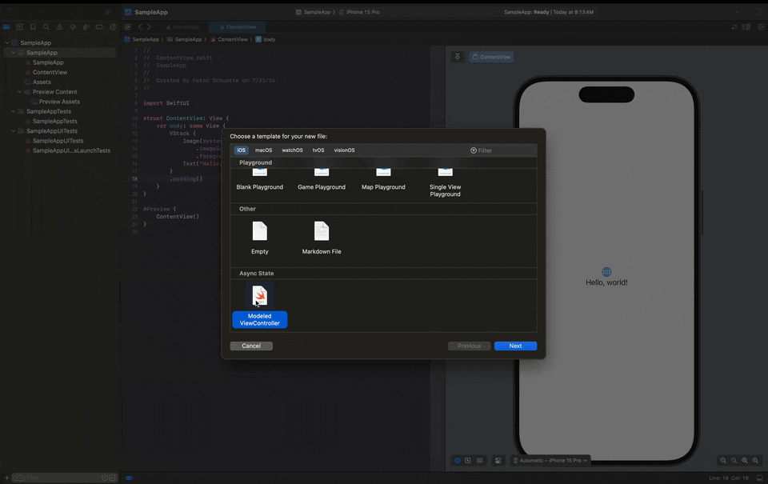

# AsyncState
Manage Swift app state asynchronously.

- [Summary](#summary)
- [Installation](#installation)
- [Usage](#usage)

## Summary
The async state framework simplifies swift object state management. It encourages single responsibility principles and state encapsulation. It was designed to be used in a stateful Model View ViewModel architecture, standard for iOS application development with UIKit.

## Installation
Async State is distributed via Swift Package Manager. Add the following to your `Package.swift` or via XCode SPM manager.

```swift
  ...
  dependencies: [
    .package(url: "https://github.com/pschuette22/async-state", from: "1.0.0"),
  ],
  .target(
    ...
    dependencies: [
      .product(name: "AsyncState", package: "async-state"),
      .product(name: "AsyncStateMacros", package: "async-state"),
    ],
  ),
```

## Usage

Async State comes with three major building blocks and helpers for each type. These building blocks are Events, Effects, and State.

### Events
Events are emitted from an object when something occurs. This could be a tap action, a system event, or anything that a programmer would like their feature to react to. These events are broadcast "vertically". Event broadcasters do not track the progress of an event nor do they care who receives them. They tell the world something happened and move on.

An object which sends events conforms to `EventStreaming`.

```swift 
final class ContactsRepository: EventStreaming {
    enum StreamedEvent: Event {
        case didAddContact(String)
    }

    // This helps with sending scope
    private let _eventBroadcast = OpenAsyncBroadcast<State>()
    var eventStream: any AsyncBroadcast<StreamedEvent> { _eventBroadcast }
}
```

### Effects
Effects are the result of events. When an object receives an event AsyncState provides helpers for mapping these events to effects. This paradigm encourages compile safety.

```swift
final class AddressBookViewModel {
    private let contactsRepository = ContactsRepository()

    func setupContactEventSubscription() {
        contactsRepository.receive(
            from: contactsRepository
        ) { contactsRepositoryEvent in
            switch contactsRepositoryEvent {
            case .didAddContact(let contactId):
                return .addContactCell(contactId)
            }
        }
    }
}

extension AddressBookViewModel: EffectHandling, EventReceiving {
    enum HandledEffect: Effect {
        case addContactCell(String)
    }

    func handle(_ effect: HandledEffect) {
        switch effect {
            case .addContactCell(String):
                // TODO: Update state to add a cell with the new contact
                break
        }
    }
}

```

### State
The AsyncState uses a type called `ObjectState` or `ViewState` as the primary mechanism for describing an object's distinct state. This is useful for modeling and managing application logic.

States should always be Value types. For example:
```swift
struct ContactsRepositoryState: ObjectState {
    var contactIds: [String]
    ...
}
```

This encapsulation allows a `StateStreaming` type of `ContactRepository` to encapuslate the management of contact IDs and broadcast changes to the world.

```swift
final class ContactRepository: StateStreaming
    typealias State = ContactsRepositoryState

    // This helps with sending scope
    private let _stateBroadcast = OpenAsyncBroadcast<State>()
    var stateStream: any AsyncBroadcast<State> { _stateBroadcast }
```

Objects interested in state changes to the contact repository may observe the change stream directly without framework functions, as well.
```swift
let contactRepository = ContactRepository()

...

let observerTask = Task { [weak contactRepository] in
    guard let contactRepository else { return }

    var stateIterator = contactRepository.stateStream.observe()
    while let newState = await stateIterator.next() {
        // Handle new state
    }
}
```

## Templates
Install templates using the install script (likely `{project-path}/.build/checkouts/async-state/xctemplates/install-xctemplates.sh`)

Run the script and templates will be installed locally. This may require an xcode restart.

Once installed, create a ModeledViewController using the latest template.


